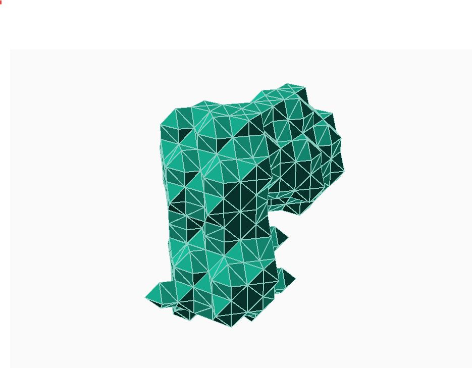
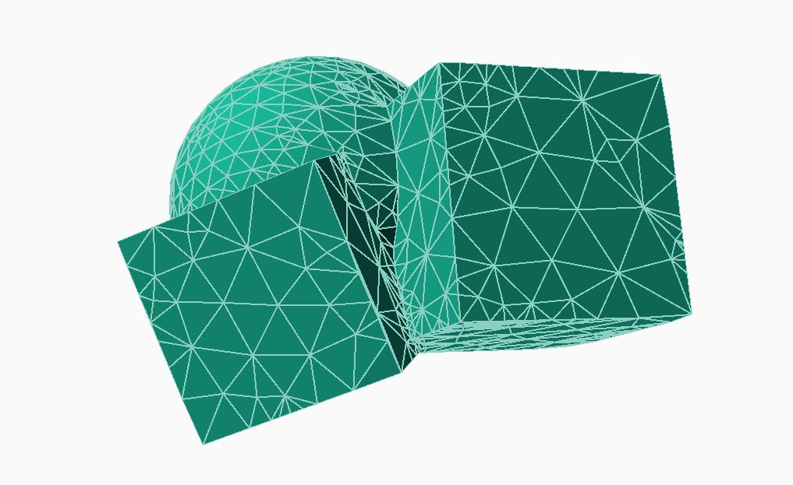

Polygonization system (not working, but work in progress)
 
 <DCworkbench.scad>  main
 
 <DCgeometry.scad> Signed distance field definition system 
 
 <DCparser_eval.scad> Signed distance field evaluation system
 
 <DCbb.scad>  Bounding box
 
 <DCmath.scad> Some common function
 
 <DCtet.scad> Base mesh constructor
 
 <DCedge.scad> edge-collapse and edge-flip functions
 
 <DCbodlib.scad> Half-edge things
 
 <polytools.scad> polymesh utiliies
 

